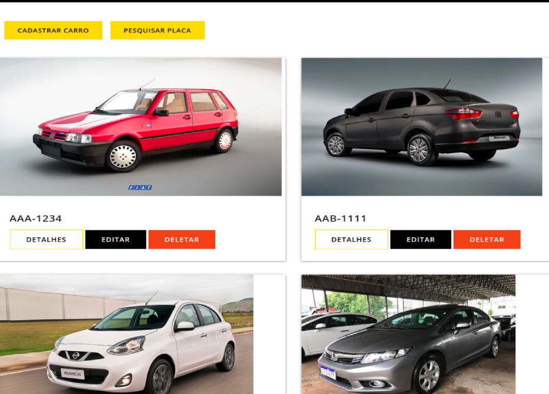

# StatusCar
> Pesquise a situação do seu próximo carro!

 
 
A violência no Brasil é uma constante e, a cada dia, surgem mais notícias sobre roubos e furtos de veículos. Isso leva muitas pessoas a recorrerem a seguros e a proteções particulares a fim de minimizar quaisquer prejuízos que venham a ter com seus veículos. Além disso, os aplicativos oficias demoram um tempo significativo para atualizarem os dados das ocorrências. 

Pensando nisso, criamos esta plaforma colaborativa a [StatusCar](http://statuscar.herokuapp.com/"StatusCar"), para que as pessoas pesquisem e possam informar as situações dos veículos e, assim, recuperar e/ou fazer as negociações de forma mais segura. 

## Instalação

Para rodar o projeto em seu computador, faça o download da pasta, e nela, execute no terminal o comando abaixo para instalar todas as dependências necessárias.

```sh
npm install 
```
Após, basta executar:

```sh
npm start 
```

## Próximas Metas

- Novos tipos de pesquisa para o cliente
- Paginação para uma melhor experiência

## Contatos

- [Rhaysa](https://www.linkedin.com/in/rlmadruga/)
- [Sebastião](https://www.linkedin.com/in/sebastiaogalindo/) 
